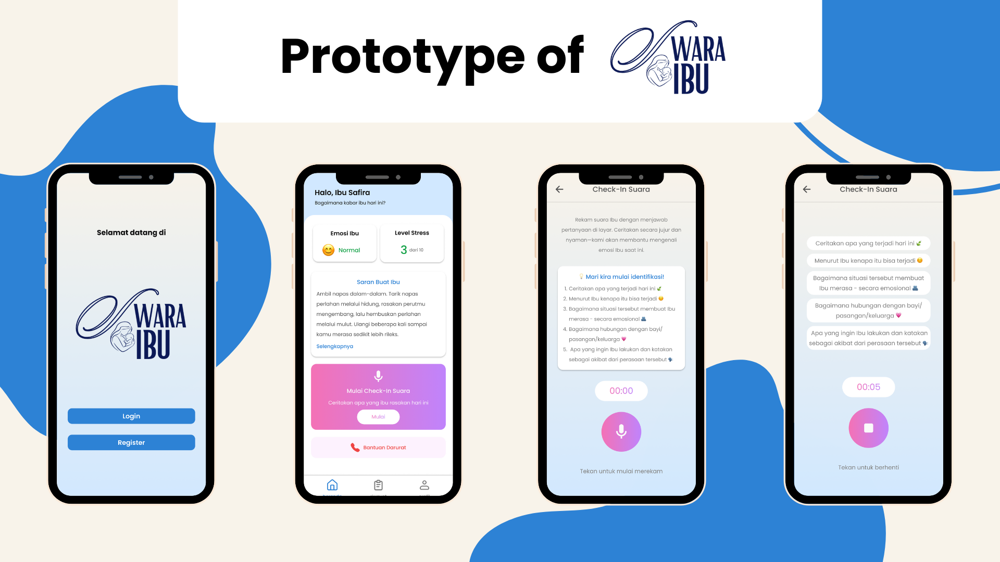
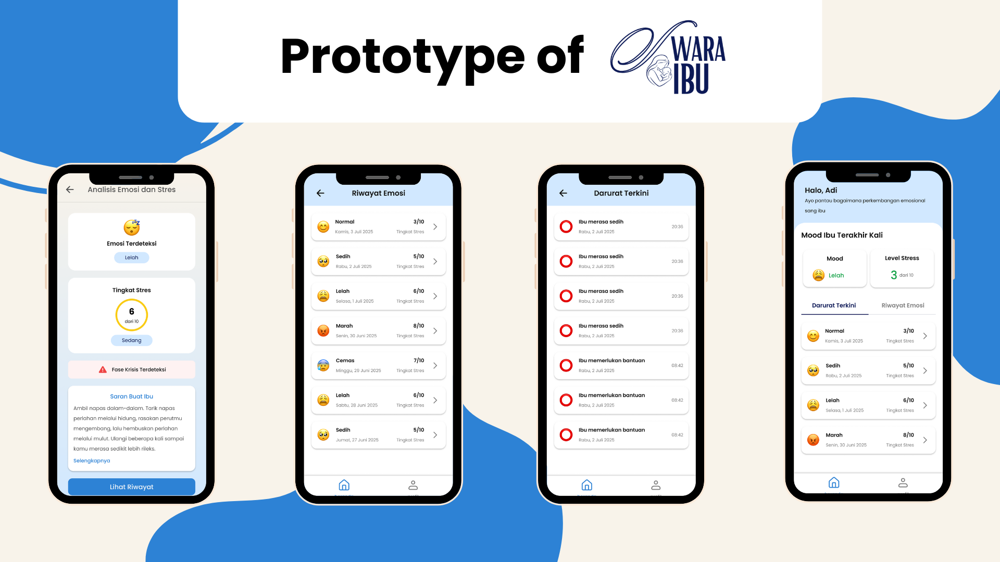

<h2 align="center">
  <b>SwaraIbu - Mobile App (Jetpack Compose) 🤰</b> 
</h2>

As a team committed to mental health awareness, we developed this **Mobile App** for Postpartum Support to help mothers facing emotional challenges after childbirth, including **postpartum depression**. This application was built as part of the **Slashcom Android Hackathon organized by UPN Veteran Jakarta**, with the goal of combining empathy and technology into a meaningful solution.

Through this app, mothers can express their feelings via voice input, which is then processed using speech recognition and emotion analysis to detect stress levels, classify mood states, identify potential crisis phases, and provide personalized suggestions based on their emotional condition. In urgent cases where a crisis is detected, the app sends an emergency alert to the closest family member, ensuring timely intervention and support.

Built using **Jetpack Compose and Firebase**, and powered by **OpenAI Whisper, Librosa, and Gemini AI**, this project showcases the integration of clean architecture and AI-driven insights to address real-world challenges. Our mission is to support mothers’ mental well-being through accessible, thoughtful mobile solutions.

We believe technology can play a powerful role in emotional care. The project is still evolving, and we’re excited to keep building it further. Feel free to explore, share feedback, and join us in making maternal mental health a shared priority. 💙🍼🧠

## ✨ Features (MVP)

The following features were implemented as part of the app's initial MVP:

- 🔊  Voice Recognition & Analysis
- ⚠️ Emergency Alert
- 📈  Mood Tracking
- 🫂  Companion Access Mode

## 🛠️ Tech Stack

- Kotlin + Jetpack Compose (UI)
- Firebase (Authentication, Realtime Database)
- Librosa (Audio Feature Extraction)
- OpenAI Whisper (Speech-to-text Conversion)
- FastAPI (Backend API)
- Gemini AI (Response Generation)

## 🧠 AI Model Repository

This mobile app is supported by two separate Python-based machine learning models that handle voice processing and emotional analysis:

1. Emotion & Stress Classification Model
🔗 [View Repository](https://github.com/samuelalfito/slashcom-2025)
This model uses Librosa for audio feature extraction and processes the extracted features to classify the user's emotional state and determine stress levels based on their voice input.

2. Crisis Phase Detection Model
🔗 [View Repository](https://github.com/muktiabdii/cek-krisis-api)
This model leverages OpenAI Whisper to convert voice recordings into text and detect whether the content indicates a potential crisis phase, enabling the app to trigger an emergency alert when needed.

Both models are integrated into the mobile app via FastAPI, ensuring a smooth and intelligent experience for mothers using the platform.

## 📸 Prototype

  

  

## 👥 Group Compile Dar Der Dor 

- [@Safira](https://www.linkedin.com/in/antikerahmasafira/) — Product Manager
- [@Aufar](https://www.linkedin.com/in/zhafir-aufar/) — Frontend 
- [@Rhesa](https://www.linkedin.com/in/rhesa-tsaqif-adyatma/) — Frontend
- [@Ovan](https://www.linkedin.com/in/samuelalfito/) — Backend
- [@Abdi](https://www.linkedin.com/in/muktiabdii/) — Backend
